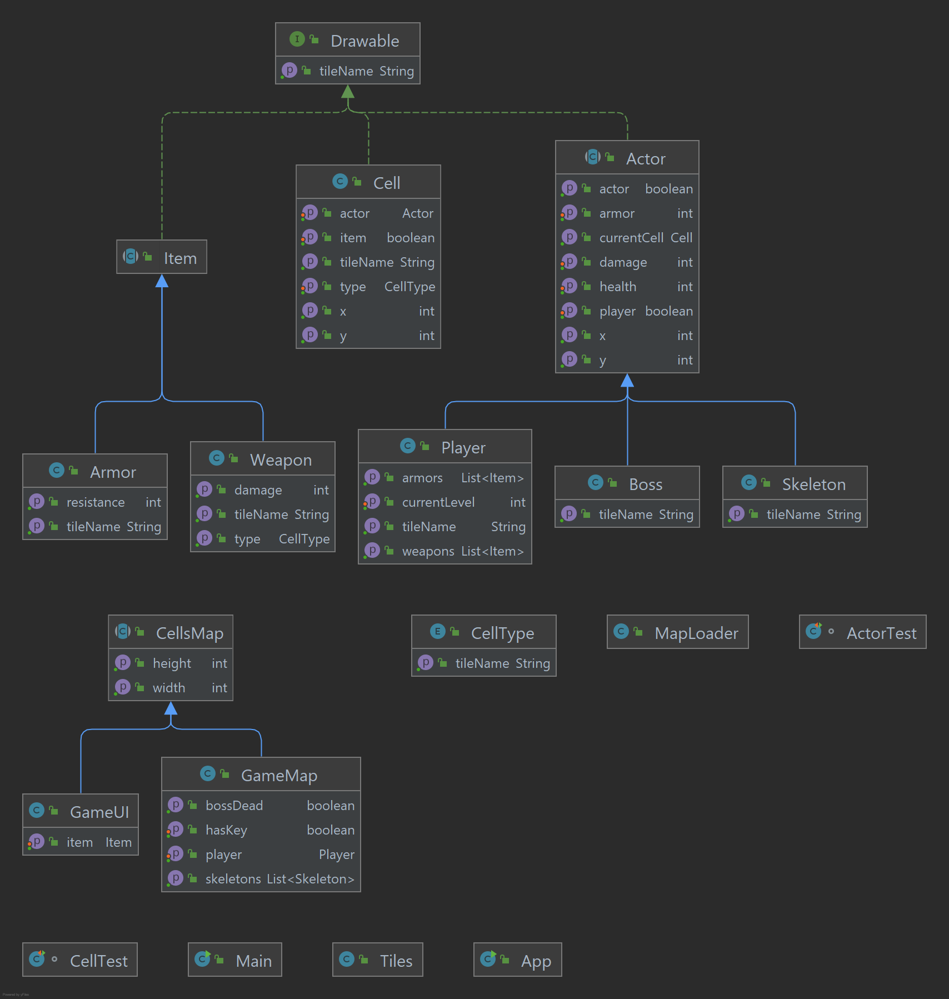

## Dungeon Crawl

## What is it?

Dungeon crawl is a rogue like game where the main character(player) have to explore some underground caves and get out alive.

## Features:

-Game interface with javafx

-Player movement using "WASD" keys

-Player has 10 lives

-There is an inventory where found items and keys can be stored

-There are different types of monsters that haunt the caves

-There are keys that have to be collected in order to open the next levels

-There are weapons that increase the player's damage

-There are armors that increase the player's armor

-The game ends when the player completes all the levels

## Technologies used:

-Java 

-JDBC

-JavaFx

## Diagram:

